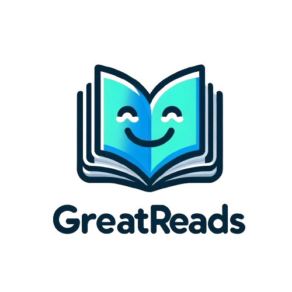

  

  <a href="https://greattreads.netlify.app/">Check out the live site!</a>

# GreatReads - A Goodreads Clone

Welcome to **GreatReads**, a book discovery and tracking platform inspired by Goodreads. This project is built using React, TailwindCSS, and Supabase, leveraging the Google Books API for fetching book information and the New York Times API for retrieving popular book lists.

## Technologies Used

- **Frontend**:
  - **React.js**: For building the user interface.
  - **TailwindCSS**: For responsive design and styling.
  - **Redux**: For state management.
  - **Lodash**: For utility functions.

- **Backend**:
  - **Supabase**: For database management and backend functionalities.
  - **NextJS**: For server-side rendering, API handling, and routing optimization. 

- **APIs**:
  - **Google Books API**: For book information.
  - **New York Times Books API**: For popular book lists.

## Features

- **Book Browsing**: Explore a vast collection of books.
- **Book Details**: View detailed information about each book, author, publication date, reviews, ratings, and a brief synopsis of the book.
- **Popular Books List**: Discover trending and popular books sourced from the New York Times API.
- **User Interactions**: Create an account, manage your book lists, write reviews and rate books and add books to your personal shelves.

## Key Features

### Book Discovery and Management
- **Browse Books**: Explore and search a wide range of books across various genres.
- **Reading Progress Tracker**: Keep track of the books you're currently reading, have read, or want to read.
  
  

### User Account and Authentication
- **User Registration**: Sign up to create a personal account.
- **Login/Logout**: Securely access your account.
- **Guest/Demo User Access**: Browse the platform without creating an account.
  
  

### Book Details and Interaction
- **View Book Information**: Access detailed information about books, including author, publication date, and synopsis.
- **Book Reviews and Ratings**: Read and leave reviews and ratings for books.
  

### Integration with External APIs
- **Google Books API**: Fetch and display detailed information on a wide array of books.
- **New York Times API**: Access and showcase updated lists of trending and popular books.

### Community Features
- **User Profile Customization**: Personalize your user profile picture, Read and leave reviews and ratings for books.

## TODOs / Features to Implement
Here are some improvements and features that can be added to the project in the future:
- [ ] Add user reading progress to dashboard.
- [ ] Implement light and dark mode for better user experience.

## Author Info

This project was created by Muntaqa Maahi. You can find more about me on my website: [muntaqamaahi.com](https://muntaqamaahi.com/).

## License

This project is licensed under the MIT License - see the [LICENSE](LICENSE) file for details.

---

[Back To The Top](#greatreads---a-goodreads-clone)
🔼

